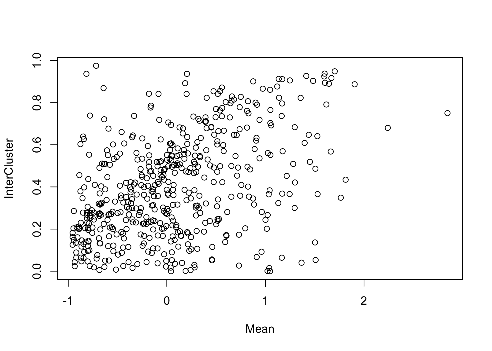

<!-- README.md is generated from README.Rmd. Please edit that file -->

# scEC

<!-- badges: start -->
<!-- badges: end -->

Single-cell Entropic Clustering (scEC) provides an entropy based
approach to normalisation, feature selection, differential expression
analysis and unsupervised clustering of single-cell RNA-sequencing data.

## Installation

You can install the the development version from
[GitHub](https://github.com/) with:

    # install.packages("devtools")
    devtools::install_github("mjcasy/scEC")

## Clustering

The basic workflow is demonstrated on the Tian et al 2018, single-cell
mixology data set, a mixture of three cancerous cell lines
(<https://github.com/LuyiTian/sc_mixology>).

    library(scEC)
    #> 
    #> Attaching package: 'scEC'
    #> The following object is masked from 'package:base':
    #> 
    #>     Map
    library(Matrix)

    load(paste0(Path, "CountsMatrix"))

    CountsMatrix <- CountsMatrix[rowSums(CountsMatrix) >= 100,]

    PopHet <- Population(CountsMatrix)
    Mean <- log10(rowMeans(CountsMatrix))
    N <- ncol(CountsMatrix)

    plot(Mean, PopHet, ylim = c(0, log(N)))

    GOI <- FeatureSelection(CountsMatrix)
    CountsMatrix <- CountsMatrix[GOI,]
    Mean <- Mean[GOI]

    Clustering <- scEC::Cluster(CountsMatrix, numClus = 3)
    InterCluster <- DifferentialExpression(CountsMatrix, Clustering)

    plot(Mean, InterCluster)

## Mapping to reference

    library("org.Hs.eg.db") 

    load(paste0(Path, "CountsMatrix"))
    MapCountsMatrix <- CountsMatrix
    load(paste0(Path, "Identity"))
    MapID <- Identity

    load(paste0(Path2, "CountsMatrix"))
    ReferenceCountsMatrix <- CountsMatrix
    load(paste0(Path2, "Identity"))
    ReferenceID <- Identity

    symbols <- mapIds(org.Hs.eg.db, 
                      keys = rownames(MapCountsMatrix), 
                      keytype="ENSEMBL",
                      column = "SYMBOL")

    syms <- symbols[!is.na(symbols)]

    MapCountsMatrix <- MapCountsMatrix[names(syms),]
    MapCountsMatrix@Dimnames[[1]] <- unname(syms)

    RefGenes <- row.names(ReferenceCountsMatrix)
    MapGenes <- row.names(MapCountsMatrix)
    CommonGenes <- intersect(RefGenes, MapGenes)

    ReferenceCountsMatrix <- ReferenceCountsMatrix[CommonGenes,]
    MapCountsMatrix <- MapCountsMatrix[CommonGenes,]

    Ident <- scEC::Map(MapCountsMatrix = MapCountsMatrix,
                       ReferenceCountsMatrix = ReferenceCountsMatrix, 
                       ReferenceID = ReferenceID, 
                       nGenes = 1000)

    knitr::kable(table(Ident, MapID))

<table>
<thead>
<tr class="header">
<th style="text-align: left;"></th>
<th style="text-align: right;">H1975</th>
<th style="text-align: right;">H2228</th>
<th style="text-align: right;">HCC827</th>
</tr>
</thead>
<tbody>
<tr class="odd">
<td style="text-align: left;">A549</td>
<td style="text-align: right;">29</td>
<td style="text-align: right;">5</td>
<td style="text-align: right;">15</td>
</tr>
<tr class="even">
<td style="text-align: left;">H1975</td>
<td style="text-align: right;">276</td>
<td style="text-align: right;">2</td>
<td style="text-align: right;">0</td>
</tr>
<tr class="odd">
<td style="text-align: left;">H2228</td>
<td style="text-align: right;">0</td>
<td style="text-align: right;">308</td>
<td style="text-align: right;">1</td>
</tr>
<tr class="even">
<td style="text-align: left;">H838</td>
<td style="text-align: right;">8</td>
<td style="text-align: right;">0</td>
<td style="text-align: right;">0</td>
</tr>
<tr class="odd">
<td style="text-align: left;">HCC827</td>
<td style="text-align: right;">0</td>
<td style="text-align: right;">0</td>
<td style="text-align: right;">258</td>
</tr>
</tbody>
</table>
